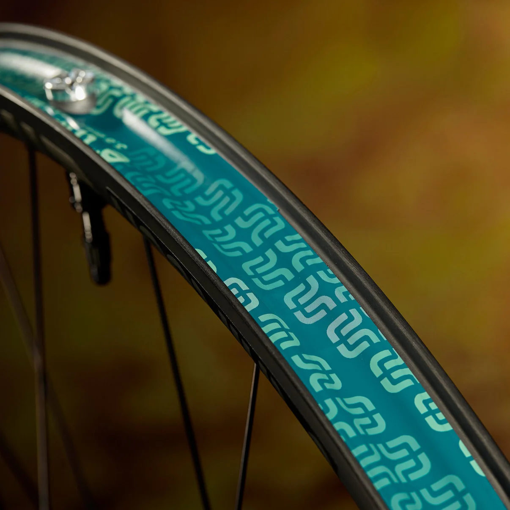
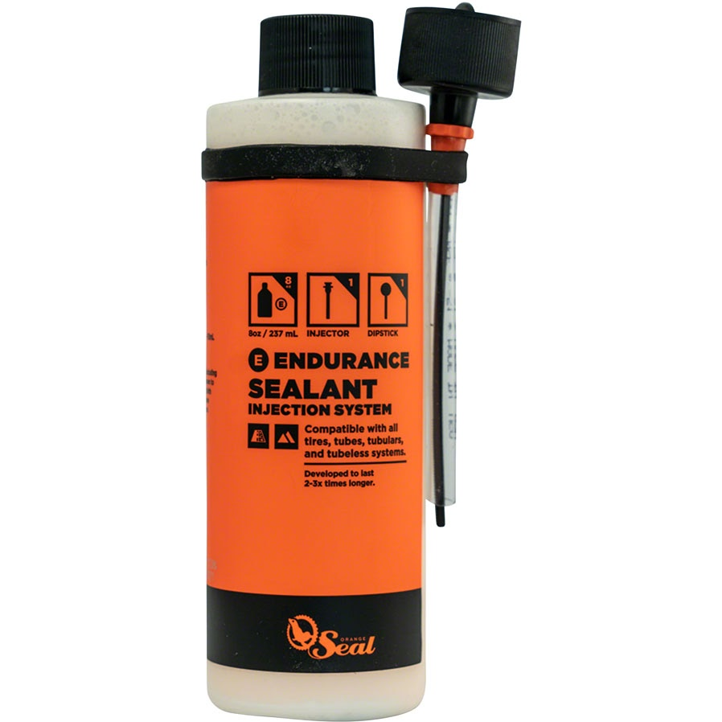

#Set up tubeless tires
If you ride bikes frequently, you've probably had it suggested that tubeless tires are a huge upgrade to running intertubes. Once you have them setup, tubeless tires really are as great as everyone says, but knowing how to set up your tires and maintain them is intimidating.

##Before you start
* Ensure that your wheels are tubeless compatibile. It should say on the wheel.
* Check if your wheels already have tubeless rim tape. This tape is wrapped around the entire inner wheel rim and covers all the spoke holes to prevent leaks.

* Buy the following items if you don't have them:
    - Tire sealant with squeezy syringe bottle
    
    - Tubeless valve stems
    - Electrical tape
    - Valve core removal tool
* This task is a lot easier if you have a big, loud air compressor with a Presta or Shrader chuck for inflating bike tires.

##Steps
1. Remove the tire and tube from your rim.

2. Add the tubeless valve stem. Use the washer on the outside of the rim to hold the valve in place.

3. If you want to be extra careful, wrap electrical tape around both sides of your rim tape.

4. Add the tire back to your rim.

5. Use a valve core tool to remove the core from your tubeless valve.

6. Add 4 oz. of sealant to your squeeze bottle, and add the syringe tip to the bottle.

7. With your valve at either 9 or 3 o'clock (instead of up or down) attach the syringe to the valve and squeeze in the sealant.

8. Add the valve core back to the Presta or Shrader valve.

9. Using your compressor, inflate the tire until you hear two loud pops which mean that the tire beads are fully seated.

10. Close valve core if using Presta.

11. Spin the wheel around and around to ensure your sealant coats the entire inside of the wheel.

12. Repeat with your other wheel and test to make sure the tires don't have any fast leaks.

13. Ride your bike a bunch to make sure the inside of the wheels continue to be fully coated until a nice seal forms. You may need to add air weekly until this happens. 