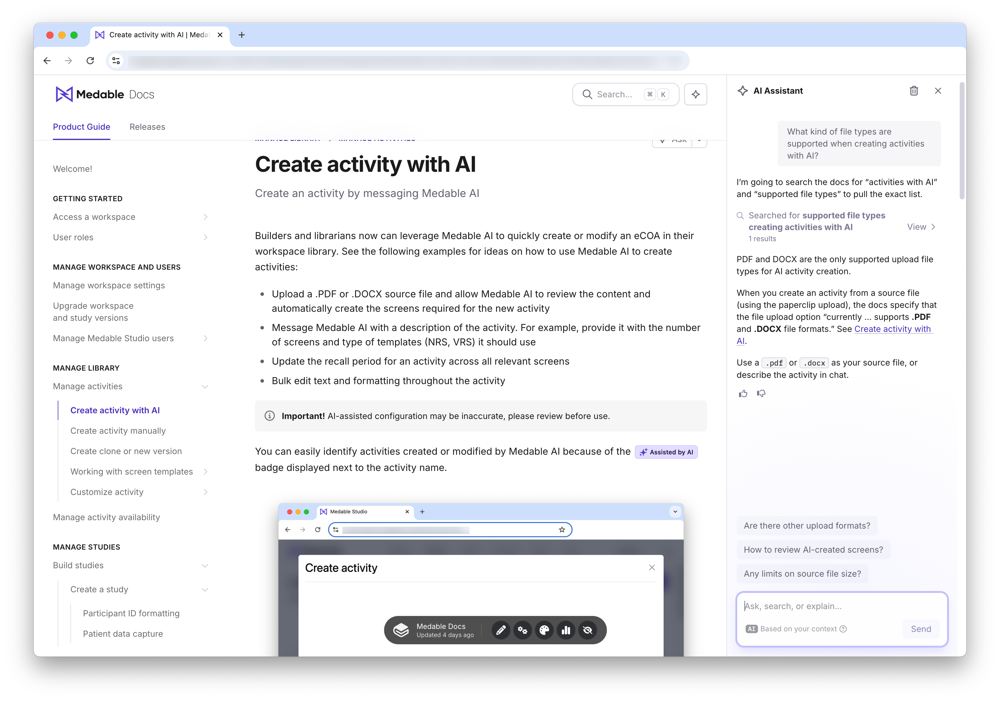

#Gitbook implementation with multiple sites and authentication
I currently have this Gitbook site implemented in my current role. It takes advantage of multiple spaces in a single site, the information is backed up to our Github repos, and it gets to leverage Gitbook's cool AI Agent.

##Details
* Visitor authentication set up so that users can access from our Product
* AI Agent turned on
* Backed up to Github
* Product Guide and Release Information are separate spaces that are included in a site
